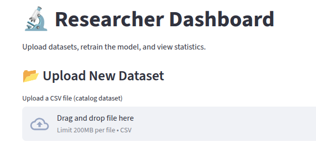
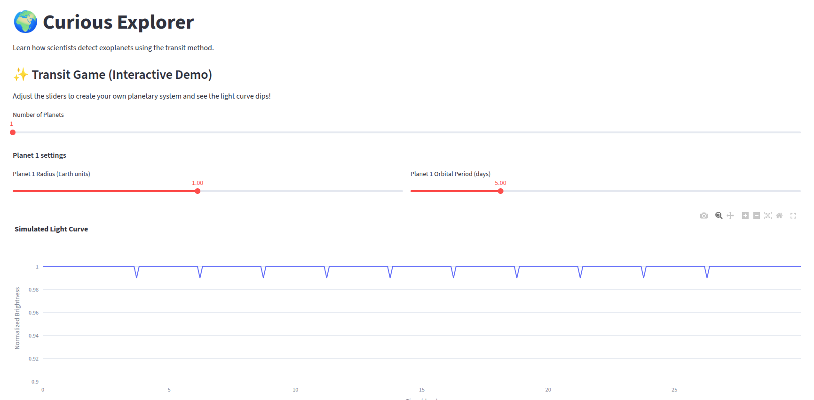
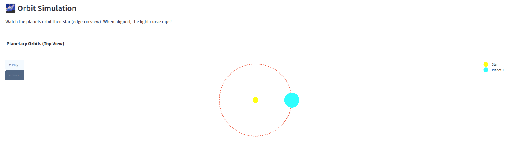
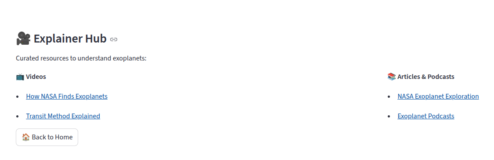
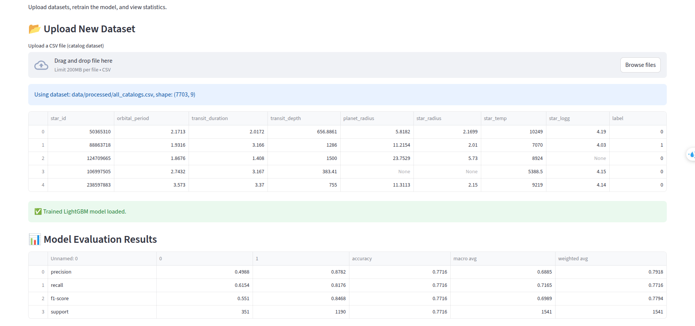

# CANO
# 🌍🌙 Exoplanet Hunt – Moon And Earth Team

  
_Built for NASA Space Apps Cairo 2025_

---

## ✨ Overview

Exoplanet Hunt is an AI/ML powered web app that automatically classifies exoplanet candidates using NASA’s **Kepler, K2, and TESS** mission datasets.  
It provides two entry points:  

- 🔬 **Researcher Mode** – Upload new datasets, retrain models, and view detailed metrics, ROC/PR curves, SHAP values, and feature importances.  
- 🌍 **Curious Explorer Mode** – Play with an interactive **Transit Game** to understand how planets cause light dips, and explore videos, podcasts, and articles.  

This project bridges professionals and novices, making **space exploration accessible** 🚀.

---

## 📊 Features

| Section          | Features                                                                                     |
|------------------|----------------------------------------------------------------------------------------------|
| **Researcher**   | 📂 Upload datasets <br> ⚡ Retrain LightGBM model <br> 📊 View metrics (Precision, Recall, F1, AUC) <br> 🖼 Download plots (ROC, PR, SHAP, Confusion Matrix) <br> 🔧 Hyperparameter tuning |
| **Curious**      | 🎮 Interactive Transit Game <br> 🌌 Orbit simulation <br> 🎥 Educational videos & 📚 articles |
| **News**         | 📰 Latest exoplanet publications & NASA feeds                                                |
| **General**      | 🏠 Modern landing page <br> 🌓 Dark cosmic theme with glowing accents <br> 🖼 Dynamic backgrounds |

---

## 📷 Screenshots

Place your screenshots in a `screenshots/` folder in the repo root and link them here 👇

### 🔬 Researcher Dashboard


### 🌍 Curious Explorer – Transit Game




### 📊 Model Evaluation


---

## ⚙️ Installation

Clone the repo and install dependencies:

```bash
git clone https://github.com/YOUR_USERNAME/exoplanet-hunt.git
cd exoplanet-hunt
pip install -r requirements.txt
```

---

## ▶️ Running Locally

```bash
streamlit run app.py
```

Then open [http://localhost:8501](http://localhost:8501) 🌐.

---

## ☁️ Deployment

- Deployed via **Streamlit Cloud** 🌍  
- Repo: `https://github.com/YOUR_USERNAME/exoplanet-hunt`  
- Main file: `app.py`  
- Configured with `requirements.txt`

---

## 📂 Project Structure

```
exoplanet-hunt/
│── app.py                # Main entry point
│── researcher.py          # Researcher dashboard
│── curious.py             # Curious explorer (game + resources)
│── news.py                # News section
│── models/                # Saved LightGBM models
│── data/processed/        # Processed datasets (Kepler, K2, TESS, merged)
│── reports/               # Evaluation reports + plots
│── requirements.txt       # Dependencies
│── screenshots/           # For README.md screenshots
```

---

## 👩‍🚀 Team

**Moon And Earth** – NASA Space Apps Cairo 2025  
- 🌙 Mohamed Sbah  
- 🌍 Collaborators & Mentors  

---

## 🛰 Credits & Resources

- [Kepler Objects of Interest](https://exoplanetarchive.ipac.caltech.edu/cgi-bin/TblView/nph-tblView?app=ExoTbls&config=cumulative)  
- [TESS Objects of Interest](https://exoplanetarchive.ipac.caltech.edu/cgi-bin/TblView/nph-tblView?app=ExoTbls&config=TOI)  
- [K2 Mission Data](https://exoplanetarchive.ipac.caltech.edu/cgi-bin/TblView/nph-tblView?app=ExoTbls&config=k2pandc)  

---

✨ _“Hunting hidden worlds, powered by AI & curiosity.”_
